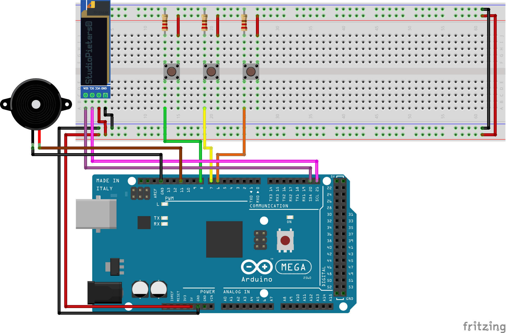

# Stefs escape room puzzle

## Building the project

I've included a schematic diagram below of how all wires and hardware should be connected.

- Red wires: 5 Volt power
- Black wires: Ground
- All other wires: Input/output/datatransfer wires

## Usage isntructions

- Top button: Reset / 0.
- Middle button: +1.
- Bottom button: Confirm / next.

Please connect the Arduino to a working power source, and have fun!